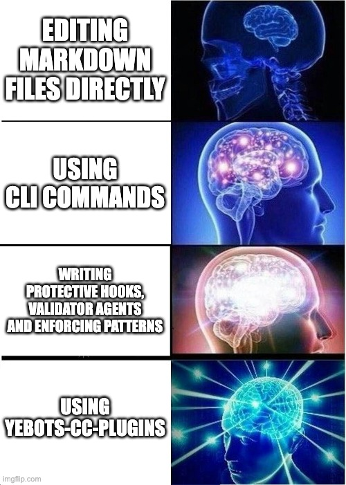

# Yebot's Claude Code Plugins



A curated marketplace of Claude Code plugins to supercharge your AI-assisted development workflow.

## What's Inside

### Workflow & Project Management

- **backlog-md** (v1.1.2) - CLI-first workflow orchestration for [Backlog.md](https://github.com/MrLesk/Backlog.md) project management with strict file naming enforcement and automated validation hooks
- **github-issues** (v1.1.1) - Elite agent for managing GitHub Issues using the gh CLI with priority labels, status management, and smart issue tracking

### Git & GitHub

- **git-github-operations** (v1.0.0) - Streamlined git and GitHub workflow commands for efficient version control operations

### Content Creation

- **astro-content-author** (v1.0.0) - Comprehensive toolkit for creating and managing content in Astro projects including markdown files, content collections, images, data fetching, and Astro DB

### Development Tools

- **documentation-tools** (v1.3.0) - Utilities for managing and organizing repository documentation for optimal Claude Code context, including commands to link documentation and plan CLAUDE.md files
- **agent-architect** (v1.0.0) - Tools and templates for designing Claude Code subagents with best practices and reusable patterns

## Installation

### Add the Marketplace from GitHub

**In Claude Code:**

```
/plugin marketplace add yebot/rad-cc-plugins
```

### Install Plugins

**Install a specific plugin:**

```
/plugin install plugin-name@rad-cc-plugins
```

**Or, browse and install interactively:**

```
/plugin
```

### Get Updates

**To receive the latest plugin updates:**

```
/plugin marketplace update rad-cc-plugins
```

Run this command periodically to get new features, bug fixes, and improvements.

## Development

See [CLAUDE.md](CLAUDE.md) for detailed documentation on plugin architecture and development.
